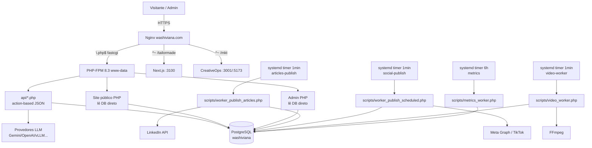

# 01 — Arquitetura Atual

> Fatos verificados em 2026-09-28 no servidor de produção.

## 1. Visão geral



## 2. Repositório e deploy

| Item | Valor |
|---|---|
| Diretório do projeto | `/var/www/washiviana.com` |
| Deploy (symlink) | `/home/washi/washiviana-site -> /var/www/washiviana.com` |
| `root` do nginx | `/home/washi/washiviana-site` |
| Config nginx | `/etc/nginx/sites-available/washiviana.com` (habilitada em `sites-enabled/`) |
| PHP-FPM | `unix:/run/php/php8.3-fpm.sock` (usuário `www-data`) |
| Workers systemd | usuário `washi`, `WorkingDirectory=/home/washi/washiviana-site` |
| Uploads | `uploads/` (~**1.8 GB**) |
| Front controller público | `index.php` (roteamento + i18n) |

> **Atenção:** o caminho real de edição é `/var/www/washiviana.com`; o nginx serve via symlink. Editar em `/var/www` reflete em produção imediatamente (não há pipeline de build de PHP).

## 3. Stack

| Camada | Tecnologia |
|---|---|
| Backend | PHP 8.3 procedural, PDO, sem framework |
| Banco (produção) | PostgreSQL (`pgsql:host=...;dbname=washiviana`) |
| Front público | PHP + Tailwind (CSS compilado) + JS |
| Admin | PHP server-rendered + `assets/js/admin.js` + `assets/css/admin.css` |
| Vídeo | FFmpeg (via `exec`) |
| Email | `mail()` (fallback: log) — `sendNotificationEmail()` |
| App JS extra | Next.js 15 / React / TypeScript em `tailormade/` (porta 3100) |

Runtimes disponíveis no servidor: **Go 1.22.2**, **Python 3.12.3**, **Node 22.23.2**, **npm 10.9.8**, **pnpm 11.25.0**.

## 4. Roteamento nginx (resumo)

- `location ^~ /tailormade` → `proxy_pass http://localhost:3100`
- `location ^~ /mkt/api/` → `http://127.0.0.1:3001/api/`; `location ^~ /mkt` → `http://127.0.0.1:5173`
- Estáticos (`css|js|png|...`) com cache 30d imutável
- Bloqueios: `/scripts`, `/migrations`, `/tests`, `/outros`, `*.sql`, **`/api/config*.php`**
- `location /` → `try_files $uri $uri/ /index.php?$query_string`
- `location ~ \.php$` → PHP-FPM (timeouts 300s)

> Isso já prova o padrão *strangler*: dá para adicionar um serviço Go atrás de um prefixo (ex.: `/go-api/`) sem mexer no resto.

### 4.1 Bloqueio do backend Go (adicionado na Fase 0)

O diretório `backend-go/` fica **dentro do webroot**; como o `try_files` serve qualquer arquivo existente, ele foi **bloqueado no nginx**:

```nginx
location = /backend-go   { return 404; }
location ^~ /backend-go/ { return 404; }
```

Sem esse bloqueio, `backend-go/go.mod` e os `.go` são baixáveis (verificado: retornava HTTP 200 antes da correção). O serviço Go roda **fora do webroot** (`/home/washi/washiviana-go/`) na porta **8081** (staging).

### 4.2 Rotas da Fase 2(c) — admin novo

```nginx
location ^~ /go-api/ { proxy_pass http://127.0.0.1:8081/; ... }   # API Go (sessão; token interno só loopback)
location = /admin-next { return 301 /admin-next/; }
location ^~ /admin-next/ { alias /var/www/washiviana.com/admin-next/; try_files $uri $uri/ /admin-next/index.html; }
```

- `/go-api/*` é público mas **exige sessão** (cookie httpOnly). O header `X-Internal-Token` só é aceito de **loopback**.
- `/admin-next/` serve a SPA estática (login-gated na API).
- **Produção:** `/go-api/` → `127.0.0.1:8082` (systemd `washiviana-go-api.service`, banco de produção, `COOKIE_SECURE=1`). A instância de staging (`:8081`) é separada e usada pelos testes.

## 5. Sessão, autenticação e CSRF (PHP)

- Nome de sessão: **`washiviana_sess`** (evita colisão com outros apps PHP no domínio).
- Tentativa de save path: `sys_get_temp_dir()/washiviana_sessions` **apenas se gravável**.
  - **Pegadinha:** esse diretório foi criado por `root` com permissão `0700`, então o **PHP-FPM (`www-data`) não consegue gravar** nele e cai para o padrão do `php.ini`: **`/var/lib/php/sessions`**.
  - Resultado: existem **dois diretórios de sessão** possíveis. Ao depurar login, verifique `session_save_path()` real (headers `X-Washiviana-Session-SavePath` na página de login).
- **Cache de configuração em sessão:** `getConfig()` guarda valores em `$_SESSION['config']` (`api/config.php:154`). Alterações no banco **não aparecem** até a sessão expirar ou ser limpa. `setConfig()` limpa o cache no mesmo request.
- Auth: tabela `usuarios`; senha com **`password_hash`/`password_verify` (BCRYPT)** (`api/auth.php:95,220,224`).
- CSRF: token em sessão; `generateCsrfToken()` / `validateCsrfToken()` (`api/config.php:403,413`). Escritas exigem `csrf_token` no POST.

## 6. Padrão das APIs

- Endpoints em `api/*.php` chamados com **POST form-data** (ou GET em leituras) contendo `action`.
- Resposta padrão: `jsonResponse()` (`api/config.php:435`) → JSON `{ "success": bool, "message": string, ... }` + HTTP status.
- Ver `03-CONTRATO-API.md` para a lista completa.

## 7. Site público (PHP)

Páginas que **leem o banco direto** (não passam pela API): `index.php`, `artigo.php`, `artigos?/conteudos.php`, `projetos.php`, `projeto.php`, `automacao-ia.php`, `design-experiencias.php`, `tech-insights.php`, `sitemap.php`.

i18n do site: `api/i18n.php` (detecção de idioma, prefixos de URL, rotas) + `api/i18n_ui.php` (strings da UI em `ui_strings`) + `configuracoes_i18n`.

## 8. Admin (PHP)

Páginas em `admin/`: `index.php` (login), `dashboard.php`, `artigos.php`, `projetos.php`, `categorias.php`, `calendario.php`, `radar.php`, `redes-sociais.php`, `configuracoes.php`, `senha.php`, `logout.php`.

Cada página:
- lê o banco direto para renderizar listas/forms;
- chama `../api/*.php` via `fetch` para mutações;
- usa `assets/js/admin.js` e `assets/css/admin.css`;
- **não é responsiva** em vários fluxos (abas `.form-tab` sem layout mobile) — dor principal a resolver.

## 9. Workers (systemd timers)

| Timer | Serviço (ExecStart) | Frequência |
|---|---|---|
| `washiviana-articles-publish.timer` | `php scripts/worker_publish_articles.php` | 1 min |
| `washiviana-social-publish.timer` | `php scripts/worker_publish_scheduled.php` | 1 min |
| `washiviana-video-worker.timer` | `php ./scripts/video_worker.php` | 1 min |
| `washiviana-metrics.timer` | `php scripts/metrics_worker.php` | 6 h |

Há também um `radar_run.php` (execução manual/planejada via `radar.php`).

## 10. Serviços externos

- **LinkedIn** (`api/linkedin.php`, `api/artigos.php`): OAuth 2.0 + API v2/UGC (`w_member_social`, OpenID `openid profile`). Callback: `api/oauth/linkedin-callback.php`. Token expira em 60 dias e é gravado em `redes_sociais_config.token_expires_at`.
- **Meta (Facebook/Instagram)** (`api/facebook.php`, `api/instagram.php`, `api/oauth_callback.php`): Graph API com troca de token curto→longo, page token.
- **TikTok / YouTube**: config em `redes_sociais_config` (YouTube guarda `refresh_token` em `dados_extras`).
- **LLM**: abstração multi-provedor em `api/gemini.php` (`getLlmProviderByType`) com `gemini`, `openai`, `deepseek`, `openrouter`, `anthropic`, `ollama`. Suporta **base URL OpenAI-compatível** via `openai_base_url` (vLLM/LM Studio). Modelos por tipo: `llm_text_*`, `llm_image_*`, `llm_video_*`.
- **FFmpeg**: pipeline de vídeo (`scripts/video_worker.php`).
- **Notificações**: `sendNotificationEmail()` (usa `mail()`).

## 11. Observações de risco

- Site público e admin dependem do **schema atual**; qualquer mudança de schema precisa manter compatibilidade ou ser coordenada.
- `uploads/` tem 1.8 GB — backup/deploy devem considerá-lo (ou ficar fora do repositório).
- Sem framework PHP: a lógica de negócio está misturada com controller (ex.: `api/artigos.php` tem 2300+ linhas). O mapeamento está em `04`.
